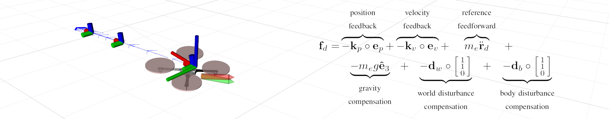

# MRS UAV Controllers

> :warning: **Attention please: This page is outdated.**
>
> The MRS UAV System 1.5 is being released and this page needs updating. Plase, keep in mind that the information on this page might not ve valid.

## Purpose of a controller within the MRS control pipeline

* receiving an all-state reference from [reference trackers](https://github.com/ctu-mrs/mrs_uav_trackers)
* outputting control command to the [HW Api](https://github.com/ctu-mrs/mrs_uav_hw_api).

## Available controllers

* "SE(3) controller"
  * geometric state feedback in SE(3) capable of precise reference tracking and fast maneuvers
  * **pros**: precise control, fast response, fast convergence
  * **cons**: sensitive to measurement noise, requires feasible and smooth reference, needs to be tuned
  * originally published in: `Lee, et al., "Geometric tracking control of a quadrotor UAV on SE(3)", CDC 2010`, [link](https://ieeexplore.ieee.org/abstract/document/5717652)
* "MPC controller"
  * SO(3) force tracking + Linear MPC for acceleration feedforward
  * **pros**: robust control, immune to measurement noise and reference infeasibilities
  * **cons**: larger control error than with SE(3)
  * briefly described in: `Petrlik, et al., "A Robust UAV System for Operations in a Constrained Environment", RA-L 2020`, [link](https://ieeexplore.ieee.org/abstract/document/8979150)
* "Failsafe controller"
  * feedforward controller for landing without a state estimator
  * is triggered in case of emergency

## Controller interface

The controllers are compiled as *ROS plugins* ([http://wiki.ros.org/pluginlib](http://wiki.ros.org/pluginlib)) with the [interface](https://github.com/ctu-mrs/mrs_uav_managers/blob/master/include/mrs_uav_managers/controller.h) defined by the [control manager](https://github.com/ctu-mrs/mrs_uav_managers).
A controller from any ROS package can be loaded dynamically by the [control manager](https://github.com/ctu-mrs/mrs_uav_managers) without it being present during [control manager](https://github.com/ctu-mrs/mrs_uav_managers)'s compile time.
Loaded controllers can be switched by the [control manager](https://github.com/ctu-mrs/mrs_uav_managers) in mid-flight, which allows safe testing of new controllers and adds flexibility the [MRS UAV system](https://github.com/ctu-mrs/mrs_uav_system).

## Loading controllers to the [Control manager](https://github.com/ctu-mrs/mrs_uav_managers)

An example controller plugin is located [here](https://github.com/ctu-mrs/example_controller_plugin).
